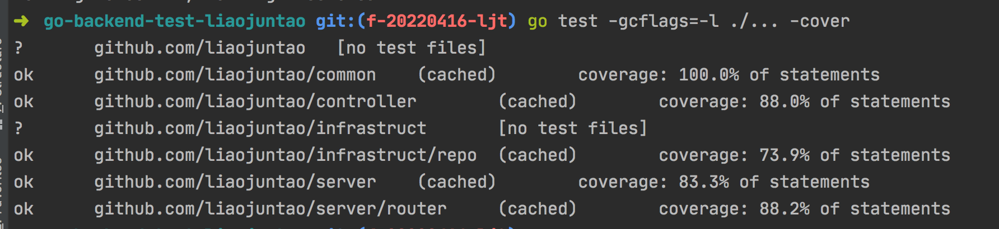

## 系统介绍
go backend test demo from liaojuntao，一个简易的用户管理系统demo,
server端算是一个对自己的challenge,自己实现的简易web框架
### 系统简析
 
- 系统主要分三层：接口层，业务层，基础服务层
    - 接口层主要是注册路由，规范restful服务接口，以及拦截器（后期可添加限流，熔断，鉴权等高级特性）
    - 业务层主要是处理业务逻辑，然后调用基础服务层（其实就是dto层）实现持久化存储
    - 基础服务层，这里抽象了一层repo，为的是将数据库解耦，便于插拔式剪裁组件。这里用作demo，简易为主，用了sqlite做存储，后期可以改用mysql，redis等实现存储
### tips for developer
1. 接口层是一个基于go的基础包http实现的一个简易web框架，只添加了两个组件router和interceptor,分别实现路由配置，以及拦截器功能
    - 注册路由及handler
    ```
    // UpdateUserRouter 更新用户的router
    func (u *UserRouter) DeleteByIdRouter() Router {
        u.path = "/user/deleteById" // set path
        u.handler = deleteByIdHandler // set handler
        return u
    }
    ```
    - 加载到server路由处理器中
    ```
    // loadRouter 加载路由
    func loadRouter() []router.Router {
        r := make([]router.Router, 0, routerNum)
        return append(r,
            router.GetUserRouter().CreateUserRouter(),
            router.GetUserRouter().UpdateUserRouter(),
            router.GetUserRouter().GetByIdRouter(),
            router.GetUserRouter().DeleteByIdRouter(),
        )
    }
    ```
    - 注册拦截器
    ```
    // serverInterceptors 设置拦截器,利用链式调用实现解耦，插件式添加拦截器
    func serverInterceptors() []Interceptor {
        i := make([]Interceptor, 0, interceptorNum)
        return append(i,
            defaultInterceptor,
            safeValidInterceptor,
        )
    }
    ```
2. controller 业务逻辑层，依赖基础设施层提供持久化服务，并且通过依赖抽象接口的方式解耦
    - 处理业务逻辑
    ```
    // CreateUser 创建用户业务逻辑
    func (u *UserCtl) CreateUser(user *infrastruct.User) error {
    	isNotExist, err := u.repo.NotExistByName(user.UserName)
    	if err != nil {
    		return err
    	}
    	if !isNotExist {
    		return errors.New("该用户名已存在")
    	}
    	return u.repo.Create(user)
    }
    ```
3. infrastruct基础设施层，目前只有sqlite实现的存储功能
    - 将业务对象进行持久化处理
        ```
        // Create 将新建对象进行持久化
        func (u *UserRepo) Create(user *infrastruct.User) error {
        	model := toSqliteModel(user) // 转换为dto层的对象进行存储
        	currentTime := time.Now()
        	model.CreateAt = &currentTime
        	return u.db.Create(model).Error
        }
        ```
### 单元测试简介
1. 单元测试设计原则：server层与controller层解耦，controller层与repo层解耦
2. 测试方法参考：可使用Makefile中的test命令，直接执行命令make test
2. 选用gomonkey作为打桩工具使用，实现对部分方法的mock实现,注意点：一些内联优化的函数是mock不了的，所以go test的时候要禁用内联。
    ```
        patch := NewPatches()
        defer patch.Reset()
    
        // 打桩controller层，router.handler的业务应与controller层解耦，所以测试用例也应该解藕
        patch.ApplyMethod(reflect.TypeOf(controller.NewUserController(nil)), "DeleteUserById",
            func(_ *controller.UserCtl, mockId int) error {
                println("heated it")
                if mockId == 222 {
                    return errors.New("controller err")
                }
                return nil
            })
    ```
3. 选用convey进行一个测试用例的阐述说明
4. 通过接口+依赖注入方式实现的repo，会直接mock一个对象进行打桩
5. 单元测试用例覆盖率>80%

### 接口设计文档参考
[api接口文档](./api_design_document.md)
### 接口测试参考
- Makefile中已经记录可执行成功的测试用例，但需要顺序执行才能保证正确，增->改->查->删
    ```
      # 测试添加用户
      test-add-user:
        curl -X POST -k -v \
            -H "Content-Type: application/json"  \
                http://127.0.0.1:8001/user/create \
            -d '{"userName":"用户1","birthOfDate":"2021-02-09","address":"广州","description":"描述1"}'
      
      # 测试修改用户，用户id有变动的，需要自己修改
      test-add-user:
        curl -X POST -k -v \
            -H "Content-Type: application/json"  \
                http://127.0.0.1:8001/user/update \
            -d '{"userId":1,"userName":"用户2","birthOfDate":"2021-02-08","address":"广州","description":"描述1"}'
      
      # 需要自己修改UserId
      test-getById:
        curl -X GET -k -v  -H "Content-Type: application/json" http://127.0.0.1:8001/user/getById?userId=1
      
      
      # 需要自己修改UserId
      test-deleteById:
        curl -X DELETE -k -v  -H "Content-Type: application/json" http://127.0.0.1:8001/user/deleteById?userId=1
    ```
- 接口测试示例 

### quick start
1. go run main.go 启动程序
2. 依次通过以下命令进行测试：
    - 新增用户： make test-add-user
    - 获取id=1的用户： make test-getById
    - 修改id为1的用户的信息 make test-add-user
    - 删除id为1的用户make test-deleteById
### about Advanced requirements
- 高级要求没有具体去实现，在注释里写了一些实现的想法
- 搜索附近的好友的实现思路：
方案一： 建立城市city表，记录省市区并给每个区一个code，存用户地址的时候可以这样存code，比如020103，02表示省，01表示市，03表示区。code相同就可以定义为相同区域的附近好友，API接口设置为传code以及mode，mode=0取同省，1取同市，2取同区。也可以将mode参数改为num，需要的附近好友个数，由服务端梯度的取用户直到满足数量要求。具体要看业务场景而定。 如：客户端希望范围交由用户决定，则可以设mode。 如果客户端只需要固定数量，就可以设num参数；具体业务场景需要具体取舍
方案二： 如果存的是地理位置经纬度，则可以通过数学公式(x-a)^2+(y-b)^2<r^2的方式，设定好半径值r以及圆心。设计一个api传入经纬度x,y以及r，获取所有在这范围内的所有用户。这样客户端可以设置梯度的r，去由近到远灵活取数。比如客户端设r=3就取到了10个，如果已经满足要求她就可以不取了，如果不满足数量要求，她可以继续增大范围取。 当然，也可以将传参r改为需要的附近好友数量，接口内部自己实现设置梯度r搜索附近好友，满足数量返回。具体业务场景需要具体取舍
